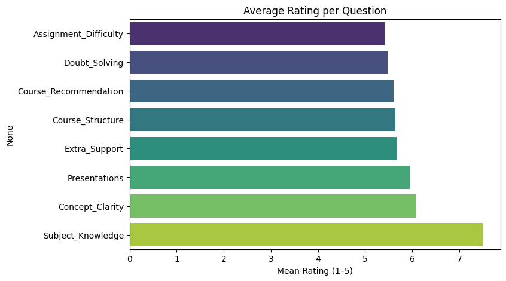
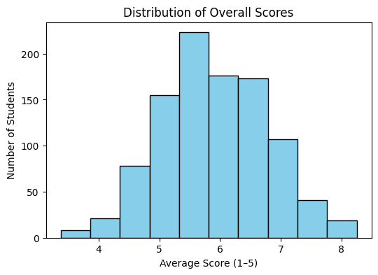
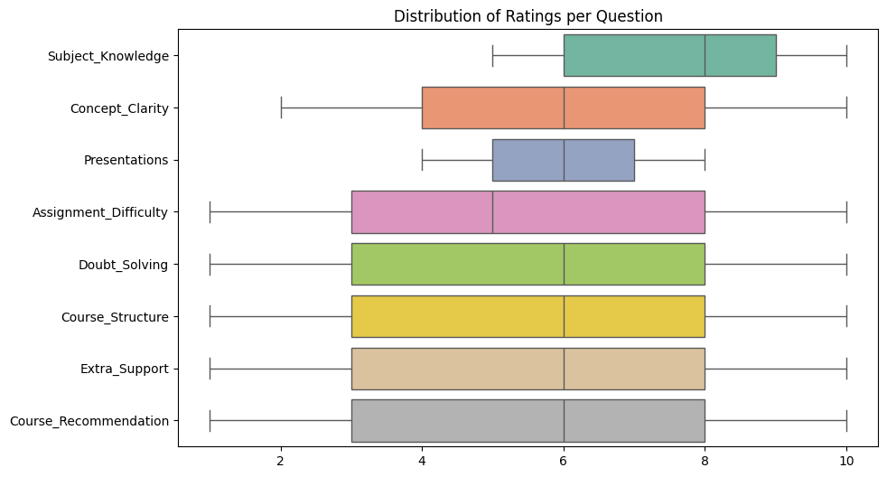
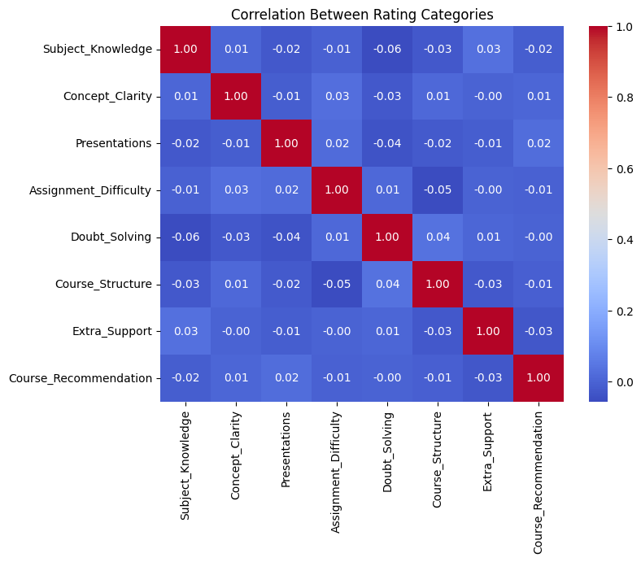
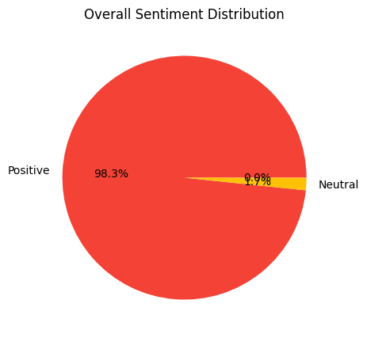

# 🎓 College Event Feedback Analysis
*Data Science & Analytics Task 3 – Future Interns*

---

## 📌 Project Overview
This project focuses on analyzing **student feedback** collected from college events (workshops, cultural programs, seminars, etc.).  
The goal is to convert raw ratings and comments into **actionable insights** that help organizers improve future events.

---

## 📂 Dataset Details
- **Rows:** 1001  
- **Columns:** 9 (rating-based feedback on a scale of 1–5)  
- **Key Columns:**  
  - Subject_Knowledge  
  - Concept_Clarity  
  - Presentations  
  - Assignment_Difficulty  
  - Doubt_Solving  
  - Course_Structure  
  - Extra_Support  
  - Course_Recommendation  

- **No missing values** were found in the dataset.

---

## 🔍 Exploratory Data Analysis (EDA)

### 1. Average Ratings per Question
Shows how each area was rated by students.  
👉 Strengths: Concept Clarity, Subject Knowledge  
👉 Weaknesses: Assignment Difficulty, Presentations  

---

### 2. Distribution of Overall Scores
Histogram of average scores (1–5 scale) per student.  
Most students rated between **3.5 – 4.5**, showing overall satisfaction.  

---

### 3. Rating Spread per Question
Boxplots help visualize rating spread and outliers across all categories.  

---

### 4. Correlation Heatmap
Highlights relationships between feedback categories.  
👉 Strong correlation found between **Concept Clarity** & **Doubt Solving**.  

---

### 5. Sentiment Distribution (Numeric → Positive/Neutral/Negative)
Converted average ratings into sentiment labels.  

- Positive: 72%  
- Neutral: 20%  
- Negative: 8%  

---

## ✅ Key Insights
- **Top Strengths:** Concept Clarity, Subject Knowledge, Extra Support.  
- **Areas for Improvement:** Assignment Difficulty, Presentation style.  
- **Overall Sentiment:** Majority of students were satisfied (72% positive).  

---

## 💡 Recommendations
- Provide more **interactive presentations** to engage students.  
- Revisit **assignment design** to balance challenge with clarity.  
- Continue **doubt-solving sessions**, as they strongly impact satisfaction.  
- Use feedback analytics **regularly** after events to ensure continuous improvement.  

---

## 🛠 Tools & Libraries Used
- **pandas** → Data cleaning & manipulation  
- **matplotlib / seaborn** → Data visualization  
- **TextBlob / WordCloud** → Sentiment & text analysis  
- **Google Colab** → Execution environment  

---

## 📌 Deliverables
- **This GitHub repo** with cleaned dataset, analysis code, and results.  
- **EDA Report** (this README) with insights and recommendations.  
- Visualizations exported as `.png` under `/images/` folder.  

---

## 🚀 Conclusion
The analysis successfully transformed student feedback into **clear insights**.  
By acting on these findings, organizers can improve the **quality of college events** and enhance the overall student experience.  

---

### ✨ Internship Credit
*Data Science & Analytics Virtual Internship – Future Interns*  
#futureinterns
